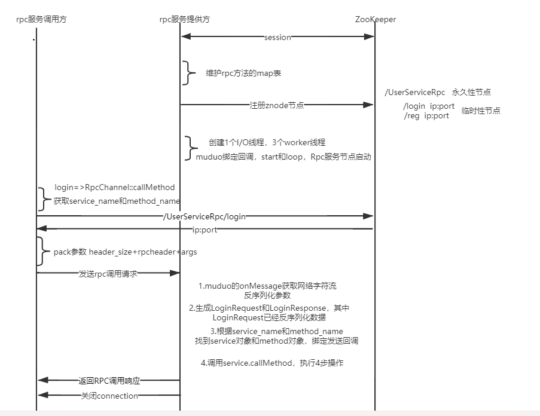
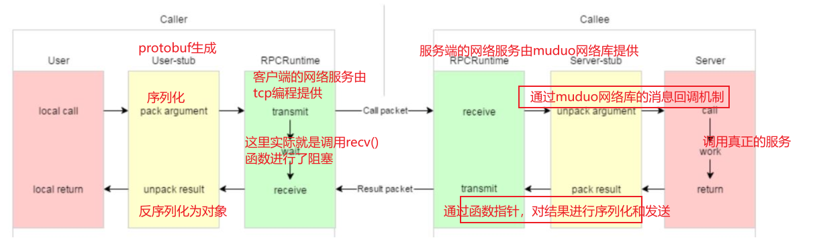

# RPC网络通信框架

### 框架所需环境
+ protobuf 工具
+ Muduo网络库
+ Boost库
+ CMake  
+ gcc 工具链
+ zookeeper
以上环境请自行配置，在此不再赘述。


## 框架总体架构


## 框架基本原理
实际上整个框架依托于两个点，第一个是`protobuf`的自动生成的继承结构，第二个是`Muduo`网络库在接受到数据的时候的回调函数的自动调用。
原理图示:




## 基础使用方式

在使用框架的时候，通过包含include下提供的头文件来调用rpc框架的功能; 在使用之前，需要利用.proto文件约定好客户端和服务端通信的格式，下面给出示例:
```
syntax = "proto3" ; 
package protocol ; // 指定包名字
option cc_generic_services = true ; 

message errInfo
{
    int32 errCode = 1 ; 
    bytes errMsg = 2 ; 
}

message LoginRequest{
    int32 id = 1 ; 
    bytes password = 2 ; 
}

message LoginResponse{
    errInfo errinfo = 1 ; 
    bool result = 2 ; 
}

service UserServiceRpc {
    rpc Login(LoginRequest) returns (LoginResponse) ; 
}
```
在.proto 文件中要表示一个服务包含三个部分：
+ 服务的参数
+ 服务的返回值
+ rpc 服务

以上述文件为例，执行`protoc user.proto --cpp_out=./` 表示根据`user.proto` 文件生成对应的cpp的源代码，此时在当前文件夹下会出现
`user.pb.cc` 和 `user.pb.cc` 文件。


### 服务器端

在编写服务器端的时候，需要自定义一个`UserService`服务类，继承自`protobuf`生成的`UserServiceRpc` **因为我们需要使用到protobuf自动生成的继承体系(实际上这个rpc框架基本原理也正与此息息相关)** ， 
服务器端编程示例:
```
#include <iostream>
#include <string>
#include <stdio.h>
#include <stdlib.h>

#include "user.pb.h"   
#include "rpcapplication.h"  // 框架提供
#include "rpcprovider.h"  // 框架提供

#include <google/protobuf/message.h> 


class UserService : public protocol::UserServiceRpc
{
public: 

    // 服务端实际提供的服务函数
    bool Login(int id , const std::string& pwd ) {
        std::cout << "Login callee sucess!" << std::endl ; 
        return true ; 
    }
    
    // 在UserServiceRpc类中的一个虚函数，进行一个重写。
    void Login(google::protobuf::RpcController* controller,   
                       const ::protocol::LoginRequest* request,
                       ::protocol::LoginResponse* response,
                       ::google::protobuf::Closure* done) override
    {
        
        // 从 request 中获得参数
        int id = request->id() ; 
        std::string password = request->password() ; 

        // 执行函数
        bool result = Login(id , password ) ; 

        // 组装返回值
        ::protocol::errInfo* errinfo = response->mutable_errinfo() ; 
        errinfo->set_errcode(0) ; 
        errinfo->set_errmsg("sucess call!") ; 
        response->set_result(result) ; 

        // 调用回调函数负责序列化结果并且发送给客户端
        done->Run() ; 
    }

} ; 

// 解析传入的参数
std::string ParseParameter(int argc , char** argv ) {
    int opt ; 
    std::string configFile ; 
    while((opt = getopt(argc , argv , "i:h")) != -1 ) {
        switch (opt) {
            case 'i' : 
                configFile = optarg ; 
                return configFile ; 
                break ; 
            case 'h' : 
                std::cout << "./a.out -i configFile" << std::endl ; 
                exit(EXIT_FAILURE) ; 
            case '?' : 
                std::cout << "error parameter" << std::endl ; 
                exit(EXIT_FAILURE) ; 
        }
    }
    return configFile ; 
}

int main(int argc , char** argv ) {
    if(argc < 2 ) {
        std::cout << "paramter error" << std::endl ; 
    }
    std::string configFile = ParseParameter(argc , argv) ; 

    // 框架提供
    RpcApplication& application = RpcApplication::GetInstance() ;  
    application.Init(configFile) ; 

    RpcProvider provider ; 

    // 向框架中注册服务
    provider.RegisterService(new UserService() ) ; 
    
    provider.Run() ;  // rpc服务跑起来
    
    return 0 ; 
}

```

### 客户端 
客户端编程示例:
```

#include <iostream>

#include "rpcchannel.h"
#include "user.pb.h"
#include "rpccontroller.h"
#include "rpcapplication.h" 


// 解析传入的参数
std::string ParseParameter(int argc , char** argv ) {
    int opt ; 
    std::string configFile ; 
    while((opt = getopt(argc , argv , "i:h")) != -1 ) {
        switch (opt) {
            case 'i' : 
                configFile = optarg ; 
                return configFile ; 
                break ; 
            case 'h' : 
                std::cout << "./a.out -i configFile" << std::endl ; 
                exit(EXIT_FAILURE) ; 
            case '?' : 
                std::cout << "error parameter" << std::endl ; 
                exit(EXIT_FAILURE) ; 
        }
    }
    return configFile ; 
}


// 客户在这里对服务器端的代码进行调用
int main(int argc , char** argv ) {

    if(argc < 2 ) {
        std::cout << "paramter error" << std::endl ; 
    }
    std::string configFile = ParseParameter(argc , argv) ; 
    
    RpcApplication::GetInstance().Init(configFile) ; 


    RpcChannel channel ;  // 表示一条通道，

    // 生成这个服务的调用类
    protocol::UserServiceRpc_Stub stub(&channel) ; // 根据这条通道创建一个新的服务

    // 构建请求消息
    protocol::LoginRequest request ; 
    request.set_id(9527) ; 
    request.set_password("123456") ; 

    // 定义接受消息的结构
    protocol::LoginResponse response ; 

    // 定义控制函数，方便后续的回调
    RpcController controller ; 

    // 阻塞式等待结果返回，controller相当于一个传出参数，用于向客户端上报框架内部的执行情况。
    stub.Login(&controller , &request , &response , nullptr ) ;   


    if(controller.Failed() ) {
        std::cout << "error occur : " ;   // 这里尝试能不能获取服务名和方法名
        std::cout << controller.ErrorText() << std::endl ;   
        exit(EXIT_FAILURE) ; 
    }

    // 没有退出，表明response中的值已经被设置好了。
    std::cout << "errcode: " << response.errinfo().errcode() <<std::endl ; 
    std::cout << "errmessage: " << response.errinfo().errmsg() << std::endl ; 
    std::cout << "result: " << response.result() << std::endl ;    


    exit(0) ; 
}


```
