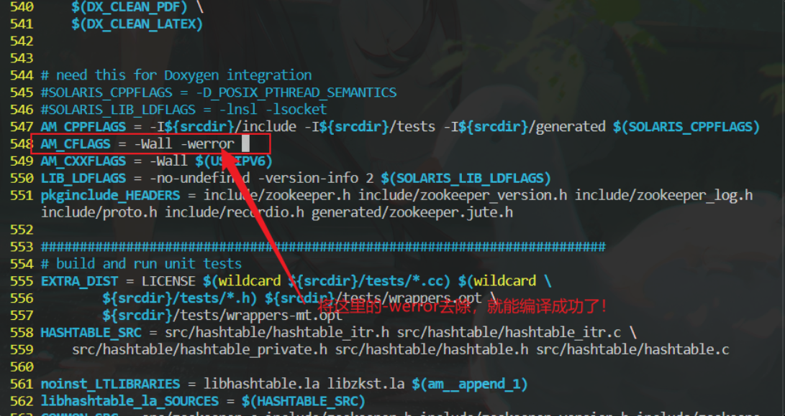
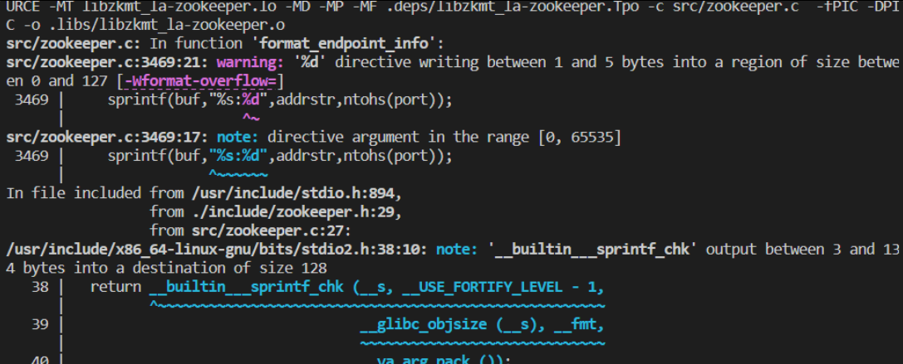

### 集群相对于分布式的缺点在哪里，为什么需要分布式?
> 先给出定义:
> + 集群：每一台服务器独立运行一个工程的所有模块。
>>+ 特点: **共享硬件资源**：集群中的多个服务器（节点）通常连接在一起，共享网络和存储资源。**高可用性**：集群通过冗余来提供高可用性，如果一个节点失败，另一个节点可以接管其任务。**负载均衡**：集群可以在多个节点之间分配负载，提高处理能力。
**单一视图**：集群对外提供统一的服务视图，客户端通常不知道后端的节点细节 
>>+ 缺点： **单点故障**：尽管集群提供了高可用性，但仍然存在单点故障的风险，如共享存储或管理节点。**扩展性限制**：集群的扩展性可能受限于网络延迟、带宽和共享资源的瓶颈。**成本**：集群可能需要昂贵的硬件和专用的网络设施。**复杂性**：集群的管理和维护可能相对复杂，尤其是在处理节点故障和数据一致性时
> + 分布式：一个工程拆分了很多模块，每一个模块独立部署运行在一个服务器主机上，所有服务器协同工作共同提供服务，每一台服务器称作分布式的一个节点，根据节点的并发要求，对一个节点可以再做节点模块集群部署.
>>+ 特点:**网络透明性**：分布式系统中的组件分布在网络的不同位置，通过网络进行通信。**可扩展性**：分布式系统可以轻松地通过增加更多的节点来扩展。
**容错性**：分布式系统设计为容忍节点故障，通常通过数据复制和自愈特性实现。
**去中心化**：控制和数据在系统中分布，没有单一的控制点。
> + 集群和分布式系统各有优势和适用场景。集群通常用于提供高可用性和负载均衡，而分布式系统则更注重可扩展性、容错性和处理大规模分布式数据的能力。选择哪种架构取决于具体的业务需求、技术挑战和资源可用性。


### protobuf 相较于json的优点有哪些，在开发RPC项目的时候，为什么要使用protobuf而不是json？请详细解释一下

  > + **protobuf相对于JSON的优点**
  >> + Protobuf 的序列化和反序列化速度通常比 JSON 快得多，因为它的数据格式更加紧凑和高效, protobuf序列化后生成的是二进制数据，不存在key-value,数据冗余更少。
  >> + Protobuf 编码的数据通常比 JSON 格式的数据小，因为它使用二进制格式，而不是像 JSON 这样的文本格式。这在网络传输中可以减少带宽消耗。
  >> + Protobuf 强制类型检查，这意味着在编译时就能发现类型不匹配的问题，而 JSON 需要在运行时解析和验证数据类型。
  >> + Protobuf 使用 .proto 文件来定义数据结构，这些文件可以独立于编程语言，然后使用 Protobuf 工具生成各种语言的代码。这使得在多语言环境中保持接口一致变得容易。
  > + **在RPC项目中为什么选择protobuf而不是json**
  >> .proto文件生成C++语言代码之后，提供了一套完整的继承体系，在使用RPC项目的时候我们可以自定义服务类继承自基类，通过基类指针给RPC提供了一种泛化的接口。从而使得RPC内部对于 客户端的数据的序列化，数据的发送，服务端的数据的反序列化，查找并调用对应的服务，序列化结果，发送回客户端的整个流程在操作的时候，都是使用的基类指针和整个继承体系提供的函数接口。


### zookeeper作为服务配置中心的优点有哪些?,相较于redis来说
> 


+ 添加一个解析错误码的宏文件(函数)，我们使用该函数去解析错误码对应的错误原因。

+ 验证 target_link_library 中的muduo_base 和 muduo_net的顺序是否影响cmake 的执行。

  > **cmake中链接库的顺序是a依赖b，那么b放在a的后面。**
  >
  > **例如进程test依赖a库,b库, a库又依赖b 库，那么顺序如下：**
  > **TARGET_LINK_LIBRARIES(test a b)**  
  >
  > 因为 muduo_net网络库依赖于muduo_base库，而两者又依赖于 pthread库，则在链接这三者的时候应该是:
  >
  > target_link_libraries(target  muduo_net muduo_base pthread  )   
  >
  > + 当一个程序或共享库依赖的静态库较多时，可能会陷入解决链接问题的坑中。如果对静态库不熟悉，可以这样写，从而忽略静态库之间的依赖次序:
  >
  >   target_link_libraries(target 
  >
  >   -Wl,--start-group
  >
  >    muduo_net 
  >
  >   muduo_base 
  >
  >   pthread 
  >
  >   -Wl,--end-group
  >
  >    )  

+ 使用自定义删除器的智能指针去实现socket文件描述符的自动的关闭。

  > ok 看一下这个实现:
  >
  > std::shared_ptr<int> sockPtr(&client_sock , [](int* sockptr)->void {
  >
  > ​        close(*sockptr) ; 
  >
  > ​        std::cout << "close socket file " << std::endl ; 
  >
  > ​    }
  >
  > ) ; 

  

+ 通过zookeeper实现对同一个服务的灾容处理

+ 在zookeeper中的文章中提及的那个对客户端的URL配置文件进行操作，尝试能不能再客户端实现对这个配置文件的一个动态更新，从而实现客户端每次只需要从本地的配置文件进行一个可用节点的获取(可以自定义一个通信处理函数，事先进行一次通信从而检测该节点是否可用。相当于一次实时心跳包)

+ 将集群聊天服务器项目和RPC项目相结合，实现分布式的聊天服务器，并且在每一个模块，进行一个横向的扩展，这里需要设计到一个mysql表格的主从复制。同一个模块，分为主机和备用机，从而实现一个灾容处理。

+ 尝试能否使用redis替代zookeeper的作用?(如果可以的话，可以尝试实现心跳机制)

+ TCP粘包问题对项目有什么影响?

+ 将日志系统修改为进程版本，实现在主进程中的多个子线程和日志进程的数据通信

  > 通信方式: 
  >
  > + 本地socket
  >   + 缺点:
  > + 管道
  >   + 缺点:
  > + 消息队列:
  >   + 缺点: 
  > + 共享内存:
  >   + 缺点:


多线程中的condition_variable析构时的死锁问题的出现:

```C++
整个进程的线程，此时2707094在
* 1    Thread 0x7f6e25a75a00 (LWP 2707094) "provider" futex_wait (private=<optimized out>, expected=12, 
    futex_word=0x56179b9974ac <RpcServerLog::getInstance()::Logger+76>) at ../sysdeps/nptl/futex-internal.h:146
  2    Thread 0x7f6e25a62640 (LWP 2707095) "provider" __futex_abstimed_wait_common64 (private=0, cancel=true, abstime=0x0, op=393, expected=0, 
    futex_word=0x56179b9974b0 <RpcServerLog::getInstance()::Logger+80>) at ./nptl/futex-internal.c:57
   
2707094 调用堆栈: 
#0  futex_wait (private=<optimized out>, expected=12, futex_word=0x56179b9974ac <RpcServerLog::getInstance()::Logger+76>) at ../sysdeps/nptl/futex-internal.h:146
#1  futex_wait_simple (private=<optimized out>, expected=12, futex_word=0x56179b9974ac <RpcServerLog::getInstance()::Logger+76>)
    at ../sysdeps/nptl/futex-internal.h:177
#2  __GI___pthread_cond_destroy (cond=0x56179b997488 <RpcServerLog::getInstance()::Logger+40>) at ./nptl/pthread_cond_destroy.c:53
#3  0x000056179b9614ba in RpcServerLog::~RpcServerLog() ()
#4  0x00007f6e25bc4495 in __run_exit_handlers (status=1, listp=0x7f6e25d99838 <__exit_funcs>, run_list_atexit=run_list_atexit@entry=true, 
    run_dtors=run_dtors@entry=true) at ./stdlib/exit.c:113
#5  0x00007f6e25bc4610 in __GI_exit (status=<optimized out>) at ./stdlib/exit.c:143
#6  0x000056179b9559b0 in RpcApplication::Init(std::__cxx11::basic_string<char, std::char_traits<char>, std::allocator<char> >) ()
#7  0x000056179b94d6fc in main ()

2707095 线程的调用堆栈：  
#0  __futex_abstimed_wait_common64 (private=0, cancel=true, abstime=0x0, op=393, expected=0, futex_word=0x56179b9974b0 <RpcServerLog::getInstance()::Logger+80>)
    at ./nptl/futex-internal.c:57
#1  __futex_abstimed_wait_common (cancel=true, private=0, abstime=0x0, clockid=0, expected=0, futex_word=0x56179b9974b0 <RpcServerLog::getInstance()::Logger+80>)
    at ./nptl/futex-internal.c:87
#2  __GI___futex_abstimed_wait_cancelable64 (futex_word=futex_word@entry=0x56179b9974b0 <RpcServerLog::getInstance()::Logger+80>, expected=expected@entry=0, 
    clockid=clockid@entry=0, abstime=abstime@entry=0x0, private=private@entry=0) at ./nptl/futex-internal.c:139
#3  0x00007f6e25c12a41 in __pthread_cond_wait_common (abstime=0x0, clockid=0, mutex=0x56179b997460 <RpcServerLog::getInstance()::Logger>, 
    cond=0x56179b997488 <RpcServerLog::getInstance()::Logger+40>) at ./nptl/pthread_cond_wait.c:503
#4  ___pthread_cond_wait (cond=0x56179b997488 <RpcServerLog::getInstance()::Logger+40>, mutex=0x56179b997460 <RpcServerLog::getInstance()::Logger>)
    at ./nptl/pthread_cond_wait.c:627
#5  0x000056179b96098f in RpcServerLog::WriteToDisk() ()
   

pid 为 2707095 的线程的部分代码
for(; ; ) {
        std::string message ; 
    {
        // 尝试获取锁
        std::unique_lock<std::mutex> lock(mtx) ; 
        while(LogQueue.empty() ) {  // 队列为空的话，我们就一直等待
            cond.wait(lock) ; 
        } 
        message = LogQueue.front() ; 
        LogQueue.pop() ; 
        cond.notify_all() ;
    }
   
}

class RpcServerLog {
public:
    static RpcServerLog& getInstance() ;   // 在构造 RpcServerLog() 的时候，启动写日志的线程。
    void WriteLogToQqueue(std::string log , LogLevel loglevel ) ; 

    // 线程函数，从队列中获取消息写入到磁盘上去，当消息队列为空的时候会被阻塞。
    void WriteToDisk() ; 

private:
    RpcServerLog() ; 
    RpcServerLog(const RpcServerLog& ) = delete ; 
    RpcServerLog(RpcServerLog&&) = delete ;
    ~RpcServerLog() ; 
    std::string GetDate() ; 
    std::string GetTime() ; 
    std::string GetLogLevel(LogLevel level ) ; 


private:
    std::mutex mtx ; 
    std::condition_variable cond ; 
    std::queue<std::string> LogQueue ; 

} ; 


可以发现，2707094 线程和 2707095 线程都阻塞在 condition_variables , 具体的来说，是因为 94线程调用exit()函数导致进程开始回收资源在销毁RpcServerLog的单例对象的时候会调用其内部成员cond的析构函数94线程层层调用到futex_wait()系统调用，又因为此时 95线程cond.wait(lock) ; 等待在cond这个条件变量上，从而导致futex_wait()的阻塞，如果想要94线程不在futex_wait()上阻塞，必须在~RpcServerLog函数中调用cond.notify_all() 唤醒等待在条件变量上的所有的线程，futex_wait()才能继续执行。

   
```


+ 为什么要引入zookeeper ？ 

  > 在分布式环境下，为了找到一个服务所位于的节点，需要一个注册中心，客户端在请求服务的时候去注册中心查找服务的地址，并且要保证一定服务一定存在，即实现一个动态注册，当服务出问题的时候(心跳机制)，在注册中心中自动的删除其对应的节点。

+ 总结一下C++封装的redis ， zookeeper ， mysql 的接口形式，写一篇文章

+ 在编译zookeeper的C语言的api的时候发现make不成功：

  ## **报出的错误:**

  '%d' [directive](https://so.csdn.net/so/search?q=directive&spm=1001.2101.3001.7020) writing between 1 and 5 bytes into a region of size between 0 and 127 \[-Werror=format-overflow=\]

  

  **错误分析：**

  linux上安装的gcc版本过高，编译检测性高

  zookeeper源码编译生成C函数接口，在./configure后生成的[Makefile](https://so.csdn.net/so/search?q=Makefile&spm=1001.2101.3001.7020 "Makefile")文件中，默认是将警告当成错误的，因此导致上图中的警告，总是以错误形式展现，编译失败

  **解决方案：**

  1.  将自己系统gcc的版本降低一些，比如7.3版本
  2.  将生成的Makefile文件中的设置的把警告当成错误去掉，然后在进行编译，编译过程中可能出现警告，但是不影响编译生成可执行文件

  ### 我使用的是方法二：

  进入到Makefile中，把werror去掉

 

  然后再次执行make命令，编译make文件，会出现如下图的警告，但是不影响编译

  

  最后在执行下面的命令，将生成的头文件和库添加到/usr中

> sudo make install


+ 关于zookeeper的多线程库和单线程库的区别，请详细区叙述一下

  > 

+ linux下的抓包工具tcpdump的简单使用

  > 